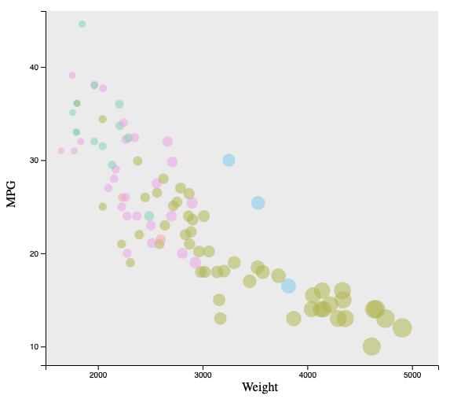
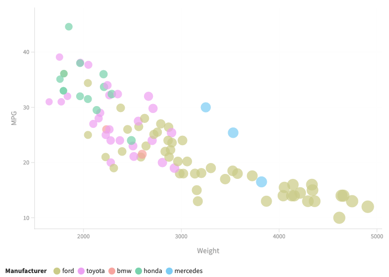
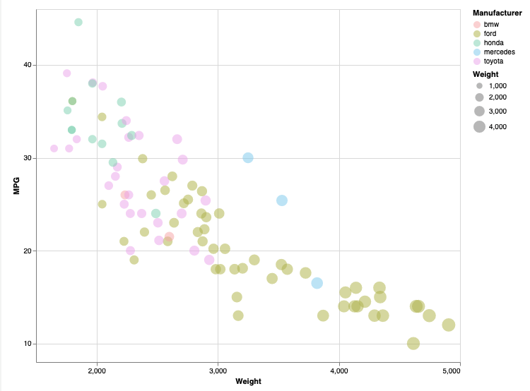

Assignment 2 - Data Visualization, 5 Ways
===

Summary
---

For Assignment 2 in CS480X I decided to go with the following three libraries and two graphing tools:

1. d3 HTML and Javascript
2. Jupyter Notebook Python Plotly
3. R + ggplot2
4. Flourish
5. Vega-Lite

-   **Miles Gregg**

    -   GitHub: https://github.com/MilesGregg

Links
---

- GitHub Pages: https://milesgregg.github.io/a1-ghd3/
- GitHub Repository: https://github.com/MilesGregg/a1-ghd3

d3
---

d3 is getting easier to use, since I started out using d3 to make the graph because I thought it would be the most difficult to design and make the replicate. However it wasn't that bad to implement once I got the initial design of the axis and lines of the graphs done. d3 has so much more flexibility to making the graphs though compared to the other four tools I used for this assignment. In my previous assignment I already had a graph made which for this assignment I edited the graph a lot to plot the data from the csv and to draw the circles on the graph. 

Jupyter Notebook Python Plotly
---

Jupyter Notebook Python being one of the most used programming languages has some incredible easy graphing interfaces. I usually use matplotlib for graph but I figured that I needed to explore a different plotting tool for python which I later found plotly. Plotly is a very easy to use graphing interface which takes up only a couple lines of code to parse and display your intended graph. I used pandas to read the csv locally and then graphed with plotly which was super easy to do. Plotly outputs the data graph to local host browser which displays the graph and points. You can also hover of the points in plotly which will tell you move information about a specific point. 

R + ggplot2
---

I used R once before when I took statistics which was useful when graphing the car data. I was able to graph the data correctly only with a few lines of code. Implementing the graph was really straight forward first R has a built in csv reader to read the data and parse it correctly. R is good as visual analysis for statistical computing. Then ggplot2 is a very popular library for making really nice looking graphs in R. I made use of the documentation: https://ggplot2.tidyverse.org/reference/, to successfully make a effective graph. Everything in R was really easy to use however I had some trouble at first importing the csv data into R studio. Other than that

Flourish
---

Flourish was a very easy software to use which had a very nice user interface with tons of options when making my graph. This software was nice to use since there was no programming involved. The very nice part of Flourish was that you could change any part of the graph which was very nice when fine tunning the graph. However it did get confusing at times on which parts to change for a specific feature on the graph. Once I got use to all of the tools it was manageable to figure out all of the needed qualifications for the needed graph. You can also see the public link to the graph here: https://public.flourish.studio/visualisation/8558801/. 

Vega-Lite
---

Vega-Lite was a very simple and easy to use graphing tool that is open sourced also. It uses just a simple json file to read specific graphing paraparameters to read the data and output a very nice graph from that data. Vega-Lite doesn't have a nice GUI interface like Flourish does, but the json file is easy to use. The website auto updates when you type new information into the json file. I believe this is the future graphing tool because it is very easy to use. It also allows you to import your csv data input into Vega-Lite which. The documentation for Vega-Lite is very nice to use and there is a ton of examples that you can use to model your plot off of.

# Achievements Description

## **Technical Achievement Description**

For the techical achievement for this assignment I was 

- I used Jupyter Notebook to make the plotly graph in becuase it was much faster at loading the http-server to Jupyter Notebook since it also uses the web browser. I was initially using just regular old python and it takes about 10 seconds to open the web port and to create the graph. 

- For the d3 graph I added a tool tip for when the user hovers over a point on the graph it will display the manufactuer, weight, and MPG of the vechicle. This text is displayed underneath the graph so the uder can see the information easily. I put it under the graph becuase if I were to put it next to the mouse cursor it would difficult to see the text with the other data points around. 

- This was my first time using a online graphing interface. The two that I used (Flourish and Vega-Lite) were very nice to use because all I had to do was import the data from my csv file and then just had to make the graphs. Both of the websites also had tons of documentation and online resources avaiable for the user. This made it very easy and fast to make nice looking graphs.

## **Design Achievement Description**

For the design achievement I was able to make a accurate graph for all five different types of data visualization softwares I used. There were a few design achievements that I accomplished which I thought were important to have:

- I was able to recreate all of the graphs from the original one given. Specifically I followed the pre-made picture as closely as possible to follow the design requriement. 

- In all of my graphs I was able to replicate the colors that were given. I was able to do this with this tool I found online called image color picker which get the HEX and RGBA value at a specfic value in the image. I used a website called: https://imagecolorpicker.com/en to get the hex and rgb values of the sample cars graph that was given. This was able to get me the values for the colors which are:

    1. Ford - HEX: #d0d08d, RGB: rgba(208,208,141,255)
    2. Toyota - HEX: #ecadf7, RGB: rgba(236,173,247,255)
    3. BMW - HEX: #f4ada7, RGB: rgba(244,173,167,255)
    4. Honda - HEX: #8bd7b4, RGB: rgba(139,215,180,255)
    5. Mercedes - HEX: #8fd3f8, RGB: rgba(143,211,248,255)

