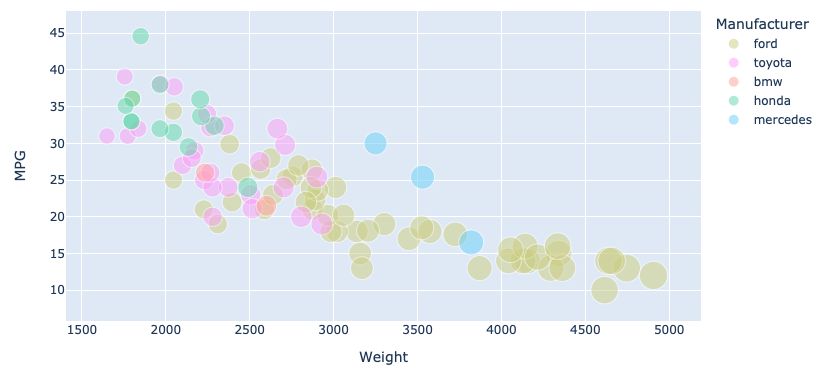
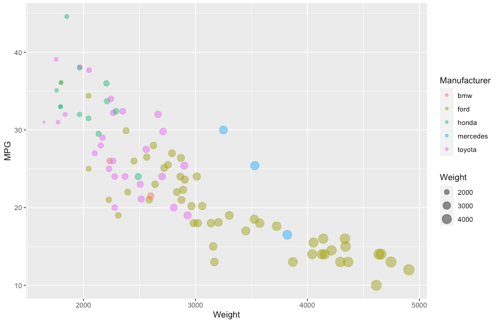
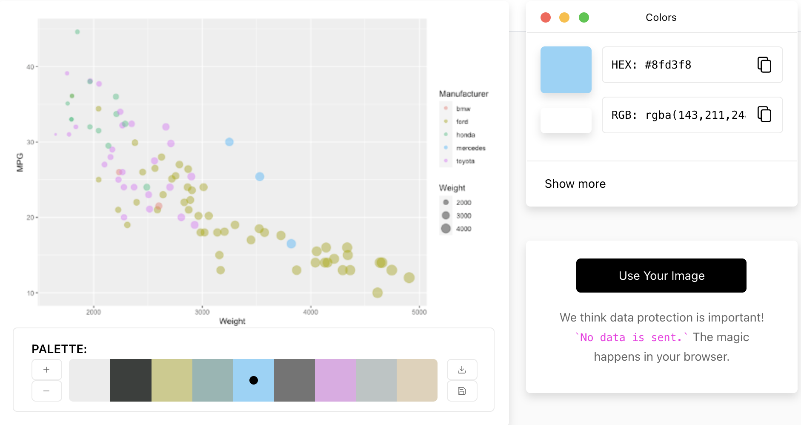

Assignment 2 - Data Visualization, 5 Ways
===

Summary
---

For Assignment 2 in CS480X I decided to go with the following three libraries and two graphing tools:

1. d3 HTML and Javascript
2. Jupyter Notebook Python Plotly
3. R + ggplot2
4. Flourish
5. Vega-Lite

-   **Miles Gregg**

    -   GitHub: https://github.com/MilesGregg

Links
---

- GitHub Pages: https://milesgregg.github.io/a1-ghd3/
- GitHub Repository: https://github.com/MilesGregg/a1-ghd3
- https://public.flourish.studio/visualisation/8558801/

d3
---

d3 is getting easier to use . I started out using d3 to make the graph becuase I tought it would be the most difficult to design and make the replicate. However it wasn't that bad to implement once I got the initial desin of the axis and lines of the graphs done. d3 has so much more flexiablity to making the graphs though compared to the other four tools I used for this assignment. In my previous assignment I already had a graph made which for this assignment I edited the graph a lot to plot the data from the csv and to draw the circles on the graph. 

Jupyter Notebook Python Plotly
---

Jupyter Notebook Python being one of the most used programming languages has some incredable easy graphing interfaces. I usually use matplotlib for graph but I figured that I needed to explore a different plotting tool for python which I later found plotly. Plotly is a very easy to use graphing interface which takes up only a couple lines of code to parse and display your intended graph. I used pandas to read the csv locally and then graphed with plotly which was super easy to do. Plotly ouputs the data graph to local host browser which displays the graph and points. You can also hover of the points in plotly which will tell you move information about a specific point. 

R + ggplot2
---

I used R once before when I took statictics which was useful when graphing the car data. I was able to graph the data correctly only with a few lines of code. Implementing the graph was really straight forward first R has a built in csv reader to read the data and parse it correctly. R is good as visual analysis for statistical computing. Then ggplot2 is a very popular library for making really nice looking graphs in R. I made use of the documentation: https://ggplot2.tidyverse.org/reference/, to sucessfully make a effective graph. Everything in R was really easy to use however I had some trouble at first importing the csv data into R studio. Other than that

Flourish
---

Flourish was a very easy software to use which had a very nice user interface with tons of options when making my graph. This software was nice to use since there was no programming involved. 

Vega-Lite
---

Vega-Lite was a very simple and easy to use grpahing tool that is open sourced also. It uses just a simple json file to read specific graphing paramaters to read the data and output a very nice graph from that data. Vega-Lite doesn't have a nice GUI interface like Flourish does, but the json file is easy to use. The website auto updates when you type new information into the json file. I believe this is the future graphing tool because it is very easy to use. It also allows you to import your csv data imput into Vega-Lite which. The documention for Vega-Lite is very nice to use and there is a ton of examples that you can use to model your plot off of.

# Achievements

## **Technical Achievement Description**

For the techical achievement for this assignment I was 

- I used Jupyter Notebook to make the plotly graph in becuase it was much faster at loading the http-server to Jupyter Notebook since it also uses the web browser. I was initailly using just regular old python and it takes about 10 seconds to open the web port and to create the graph. 

- 

## **Design Achievement Description**

For the design achievement I was able to make a accurate graph for all five different types of data visualization softwares I used. There were a few design achievements that I accomplished which I thought were important to have:

- For the d3 graph I added a tool tip for when the user hovers over a point on the graph it will display the manufactuer, weight, and MPG of the vechicle. This text is displayed underneath the graph so the uder can see the information easily. I put it under the graph becuase if I were to put it next to the mouse cursor it would difficult to see the text with the other data points around. 

- I used a website called: https://imagecolorpicker.com/en to get the hex and rgb values of the sample cars graph that was givin to me. This was able to get me the values for the colors which are:

1. Ford - HEX: #d0d08d, RGB: rgba(208,208,141,255)
2. Toyota - HEX: #ecadf7, RGB: rgba(236,173,247,255)
3. BMW - HEX: #f4ada7, RGB: rgba(244,173,167,255)
4. Honda - HEX: #8bd7b4, RGB: rgba(139,215,180,255)
5. Mercedes - HEX: #8fd3f8, RGB: rgba(143,211,248,255)

